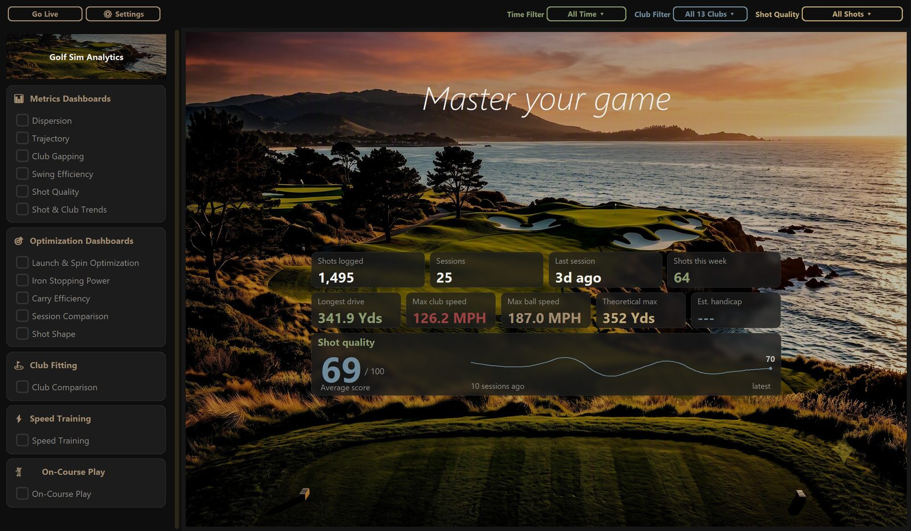
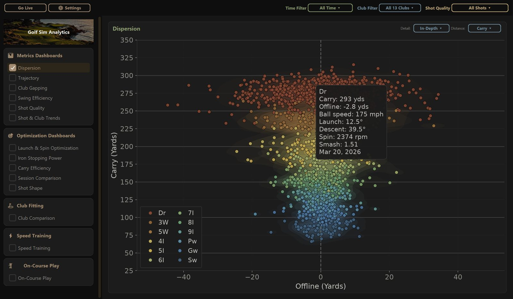
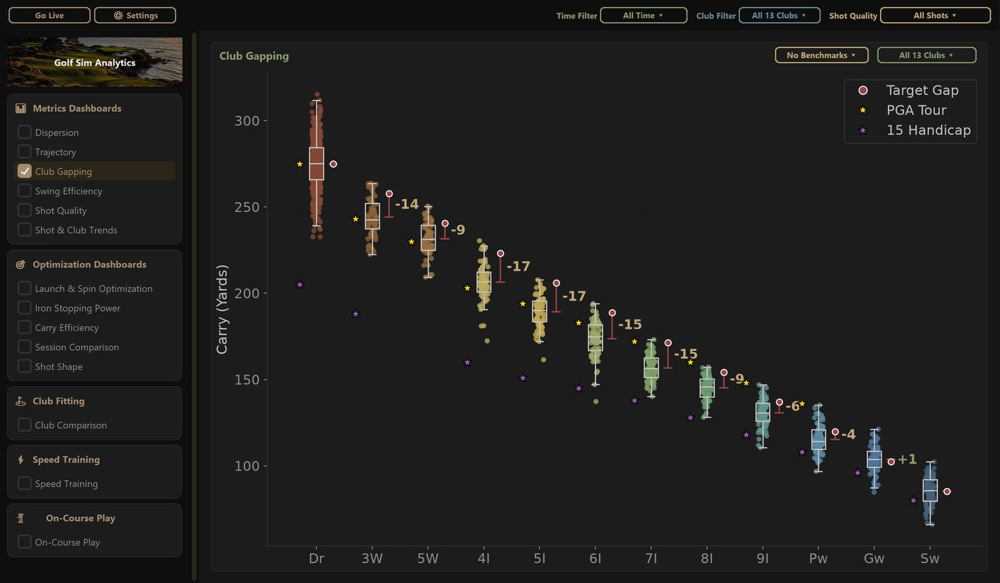
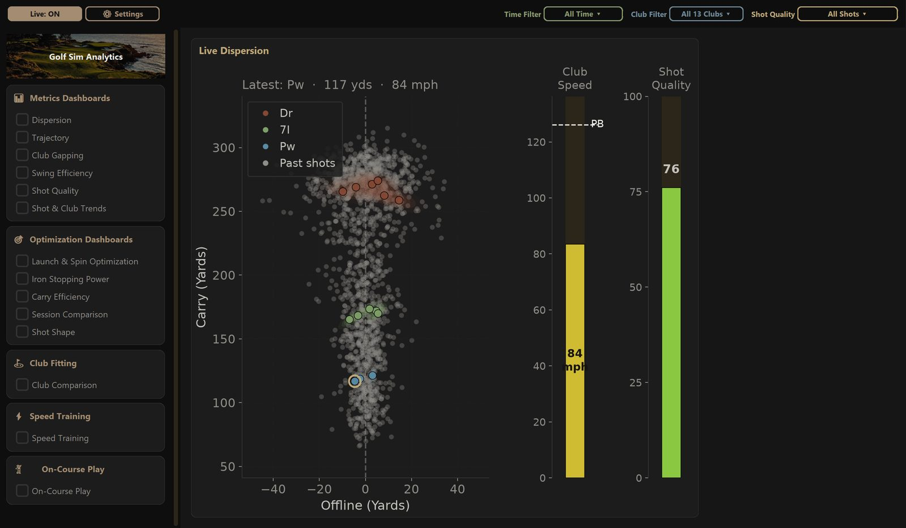
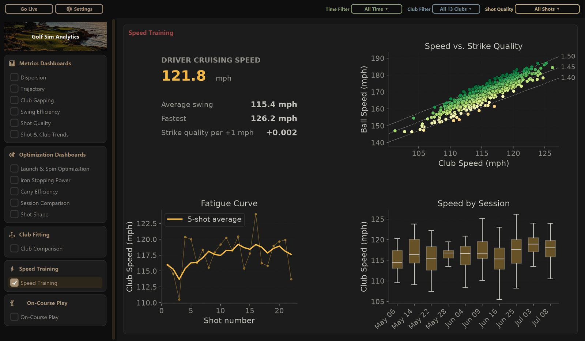

# Golf Sim Analytics

**Every shot. Every insight.** A Windows desktop analytics companion for [GSPro](https://gsprogolf.com/) golf simulators — it captures every shot you hit, automatically, and turns your practice into fifteen interactive dashboards.



## Highlights

- **Zero-click data capture.** GSPro's Practice Range "Export CSV" always saves to the Desktop — this app watches for it, ingests it, and refreshes within seconds. No import buttons, no file dialogs.
- **Live round tracking.** Shots appear on the Live Dispersion chart in real time as you hit, with gauges tracking club speed against your personal best and the quality of your last strike. Finished rounds archive themselves.
- **Deep per-shot analytics.** Hover any point for carry, ball speed, launch, descent, spin, and smash factor — each flagged against that club's ideal window.
- **Benchmarks.** Overlay PGA Tour averages or any handicap level (5–20) on your own numbers with one click.
- **A built-in fitting bay.** Compare shafts / adapter settings head-to-head with live shot capture per configuration.
- **Your data stays yours.** Everything lives in local Parquet files next to the app. Edits (hiding sessions, reassigning mis-clubbed shots) are reversible sidecars — the archived data is never touched.

## Dashboards

| Category | Dashboards |
|---|---|
| Metrics | Dispersion · Trajectory · Club Gapping · Swing Efficiency · Shot Quality · Shot & Club Trends |
| Optimization | Launch & Spin · Iron Stopping Power · Carry Efficiency · Session Comparison · Shot Shape |
| Club Fitting | Club Comparison (adapter A/B testing with live capture) |
| Speed Training | Cruising speed, fatigue curve, speed vs. strike quality, long-term progression |
| On-Course | Automatic scorecards — holes, birdies, scoring breakdown, longest drives |
| Live | Real-time dispersion for the round in progress |









## Getting started (from source)

Requires Windows and Python 3.11+.

```
pip install -r requirements.txt
python app.py
```

That's it. On first launch the app creates its data folders (`raw_csvs/`, `parquet_data/`, `logs/`) next to itself and opens to the landing page.

**No simulator handy?** Open **⚙ Settings → Use sample data** to explore two bundled synthetic datasets (a 6-month baseline and a 2-year speed progression).

## How data gets in

1. **Automatic Desktop pickup** — hit *Export CSV* in GSPro's Practice Range; the app copies it off the Desktop (your file is never moved or deleted), ingests it, and refreshes. Non-GSPro CSVs on the Desktop are ignored.
2. **Live tracking** — with GSPro running, shots are tracked continuously from GSPro's round file, enriched with club data from GSPro's own database, and archived automatically when the round ends. If a CSV export of the same round shows up later, it's reconciled into the live-tracked session instead of duplicating it.
3. **Manual drop** — any GSPro CSV placed in `raw_csvs/` is ingested within seconds.

## Building for distribution

Two options, both Windows-only and requiring nothing on the end user's machine — no Python, no command line:

**Windows installer (recommended)** — a normal double-click setup wizard (Next → Next → Finish), with a Start Menu shortcut, an optional Desktop icon, and a clean entry in *Add or Remove Programs*.

```
build_installer.bat
```

Needs [Inno Setup 6](https://jrsoftware.org/isinfo.php) (`winget install JRSoftware.InnoSetup`) in addition to Python. It builds the exe (see below) and compiles `installer/GolfSimAnalytics.iss` into `installer/Output/GolfSimAnalytics-Setup.exe` — that one file is everything you hand to a user. It installs **per-user** into `%LocalAppData%\GolfSimAnalytics` (no admin rights, no UAC prompt) — required by this app's data-storage design, since it keeps `raw_csvs/`, `parquet_data/`, and `logs/` next to its own exe, and that location has to be writable without elevation. Uninstalling removes everything the installer shipped; any data the user generated (their real shot history) is left alone.

**Portable folder** — no installer, just a folder to unzip and run.

```
build_exe.bat
```

Produces `dist/GolfSimAnalytics.exe` plus the course photo and sample datasets alongside it — the `dist/` folder is the complete portable install and looks identical to running from source. Users extract it anywhere writable (not `Program Files`) and double-click the exe directly.

Either way, the exe is unsigned, so Windows SmartScreen shows a one-time warning on first run (*More info → Run anyway*).

## Development

```
python -m pytest
```

Project layout:

```
app.py            entry point (DPI awareness, scaling, window boot)
config.py         paths, color tokens, club normalization, fitting windows, benchmarks
data/             ingestion, Parquet store, filters, edits, analytics engines
live/             GSPro live-round watcher + GSPro.db club-data lookup
ui/               customtkinter shell, theme, reusable widgets
ui/charts/        one module per dashboard + a data-driven registry
tools/            sample-data generators
tests/            pytest suite
```

## Notes

- Windows-only: the UI uses per-monitor DPI awareness, dark title-bar theming, and watches GSPro's per-user data folder — all Windows-specific.
- Temperature normalization, warm-up shot filtering, mulligan handling, and on-course/practice separation are all opt-in via **⚙ Settings**.
